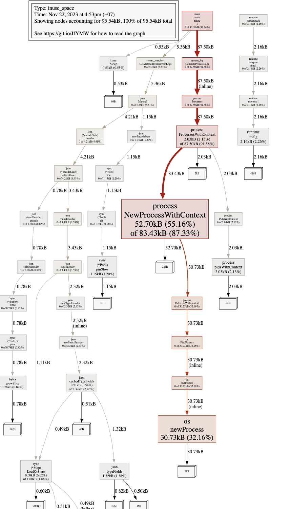

# terms > profiling


## Profiling with go test
- To profile, there are 2 steps needed:
    - generate profile output file
    - analysis that output file

- The first step `generate profile output file` can be done in 2 ways: 
    - Way 1: Specify commands when running `go test`. Example: running `go test <package> -cpuprofile cpu.prof` will generate `cpu.prof`, which is a CPU profile output
        - This way is impossible with `go run`
    - Way 2: Write the profile output file by code
        ```
        cpuProfile, err := os.Create("cpu.prof")
        if err != nil {
            log.Fatal(err)
        }
        pprof.StartCPUProfile(cpuProfile)
        defer pprof.StopCPUProfile()
        ```

- The second step is using `pprof` to analysis with profile output file. Example: `pprof cpu.prof`

- Both of the above steps can be done by only single click to `Profile <test_function> with 'CPU Profiler'` in Goland.

- References: 
    - pprof library: https://github.com/google/pprof
    - CPU Profiler in GOland: https://www.jetbrains.com/help/go/cpu-profiler.html

## Profiling with short lived program
- To profile, must do 2 steps mentioned in `Profiling with go test`. Therefore, the steps required are: 
    - Generate profile output file by using this code 
        ```
        cpuProfile, err := os.Create("cpu.prof")
        if err != nil {
            log.Fatal(err)
        }
        pprof.StartCPUProfile(cpuProfile)
        defer pprof.StopCPUProfile()
        ```
    
    - Use pprof to analysis the cpu.prof: `pprof cpu.prof`

## Profiling with background / running service
- We will need to open an api so the `pprof` tool can connect to it
    - Step 1: Enable `pprof` inside the service by adding an unused import: `import _ "net/http/pprof"`
    - Step 2: Start a new service in a new port 
        ```
        go func() {
            fmt.Println(http.ListenAndServe("localhost:6060", nil))
        }()
        ```
    - Step 3: Use `pprof` to analysis
        ```
        go tool pprof http://localhost:6060/debug/pprof/heap
        ```
        or simply the following if you had installed pprof globally
        ```
        pprof http://localhost:6060/debug/pprof/heap
        ```
    - Bonus step: visualize the heap by typing `web` inside the terminal running `pprof`. The result can be looked like this

        

- References: 
    - https://dev.to/agamm/how-to-profile-go-with-pprof-in-30-seconds-592a